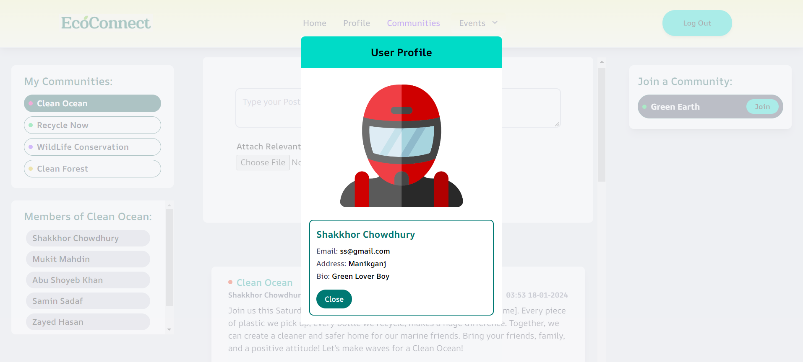
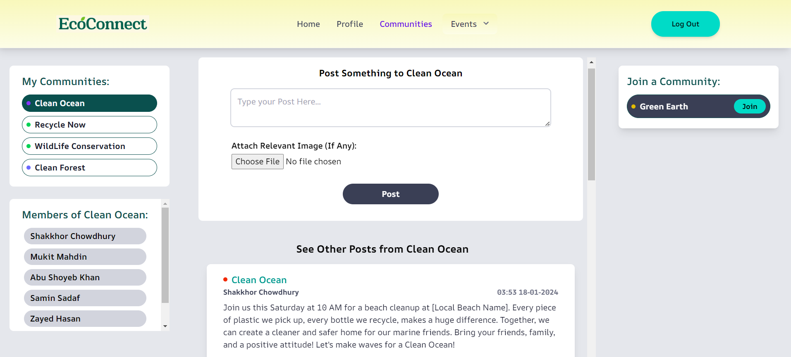

<!-- Improved compatibility of back to top link: See: https://github.com/othneildrew/Best-README-Template/pull/73 -->

<a name="readme-top"></a>

<!--
*** Thanks for checking out the Best-README-Template. If you have a suggestion
*** that would make this better, please fork the repo and create a pull request
*** or simply open an issue with the tag "enhancement".
*** Don't forget to give the project a star!
*** Thanks again! Now go create something AMAZING! :D
-->

<!-- PROJECT SHIELDS -->
<!--
*** I'm using markdown "reference style" links for readability.
*** Reference links are enclosed in brackets [ ] instead of parentheses ( ).
*** See the bottom of this document for the declaration of the reference variables
*** for contributors-url, forks-url, etc. This is an optional, concise syntax you may use.
*** https://www.markdownguide.org/basic-syntax/#reference-style-links
-->
<!-- PROJECT LOGO -->
<br />
<div align="center">
    

  <h3 align="center">EcoConnect</h3>

  <p align="center">
    An Eco friendly social media for environment enthusiasts
  </p>
</div>

<!-- TABLE OF CONTENTS -->
<details>
  <summary>Table of Contents</summary>
  <ol>
    <li>
      <a href="#about-the-project">About The Project</a>
      <ul>
        <li><a href="#built-with">Built With</a></li>
      </ul>
    </li>
    <li>
      <a href="#getting-started">Getting Started</a>
      <ul>
        <li><a href="#installation">Installation</a></li>
        <li><a href="#test">Run Tests</a></li>
        <li><a href="#run">Run</a></li>
      </ul>
    </li>
    <li><a href="#screenshots">Screenshots</a></li>
  </ol>
</details>

<!-- ABOUT THE PROJECT -->

## About The Project

A Sustainable Living Social Network for Eco-Conscious People and Communities.

### Team Members

<a href="https://github.com/HasnainKabir-repos/">
    <h2>A Z Hasnain Kabir</h2>
</a> <br>

<a href="https://github.com/mamunur03">
    <h2>Mamunur Rahman</h2>
</a> <br>

<a href="https://github.com/mahdin70">
    <h2>Mukit Mahdin</h2>
</a> <br>

<p align="right">(<a href="#readme-top">back to top</a>)</p>

### Built With

- [![React][React.js]][React-url]
- [![Node][Node.js]][Node-url]
- [![MongoDB][MongoDB]][MongoDB-url]
- [![Express][Express.js]][Express-url]
- [![Mocha][Mocha]][Mocha-url]

<p align="right">(<a href="#readme-top">back to top</a>)</p>

<!-- GETTING STARTED -->

## Getting Started

To set up the project locally you need to follow the following steps

### Installation

Install all dependencies

- npm

  ```sh
  npm install
  ```

  - npm

  ```sh
  cd backend
  npm install
  ```

- npm
  ```sh
  cd ../frontend
  npm install
  ```

### Tests

- npm
  ```sh
  npm run test
  ```

### Run

- npm
  ```sh
  npm run dev
  ```

<p align="right">(<a href="#readme-top">back to top</a>)</p>

### Screenshots

<details>
    <summary><strong>Screenshots taken of major parts of the project</strong></summary>
  

  
  
  
  
    


</details>

<p align="right">(<a href="#readme-top">back to top</a>)</p>


<!-- MARKDOWN LINKS & IMAGES -->
<!-- https://www.markdownguide.org/basic-syntax/#reference-style-links -->

[React.js]: https://img.shields.io/badge/React-20232A?style=for-the-badge&logo=react&logoColor=61DAFB
[React-url]: https://reactjs.org/
[Node.js]: https://img.shields.io/badge/node.js-6DA55F?style=for-the-badge&logo=node.js&logoColor=white
[Node-url]: https://nodejs.org/
[Express.js]: https://img.shields.io/badge/express.js-%23404d59.svg?style=for-the-badge&logo=express&logoColor=%2361DAF
[Express-url]: https://expressjs.com/
[MongoDB]: https://img.shields.io/badge/MongoDB-%234ea94b.svg?style=for-the-badge&logo=mongodb&logoColor=white
[MongoDB-url]: https://mongodb.com/
[Mocha]: https://img.shields.io/badge/-mocha-%238D6748?style=for-the-badge&logo=mocha&logoColor=white
[Mocha-url]: https://mochajs.org/
